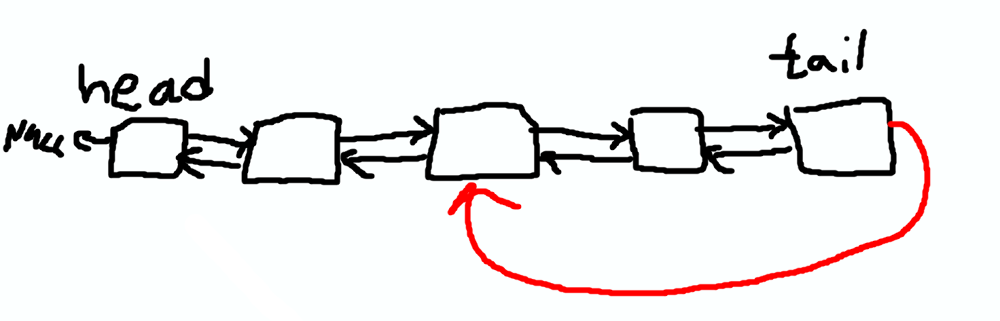

# Упражнение 2

Изполвайте имплементацията на двузвързан списък от миналия час или някоя ваша ако имате такава за следващите задачи. За най-лесно работете директно върху файлва, който съм подготвил - `tasks.c`. С него може директно да тествате дали сте направили задачите ок.

# Задача 1

Довършете функциите за `insertAfter`, `insertBefore` и `removeAt` намиращи се в `dlist.c`. Тук ще работим само с целите Node-ове, а не стойностите в тях.

# Задача 2

Използвайки написаните функции в първа задача реализайте InsertionSort, но върху двусвързания списък. Функцията е дефинирана в `tasks.c` трябва да я попълните. В решението е нужно при местене на елементи да местите целите
`Node` структури и да пренареждате указателите в тях а не просто да копирате `int` стойностите в тях.

# Задача 3

Довършете функцията `Node* getMid(DList* l)`, която връща елемента посредата на списък. Бонус точки ако го направите с едно обхождане на списъка. Тоест НЕ трябва да обходите веднъж за да видите размера и после да направите `getAt` на половината ами по някакъв начин да получите достъп до средния елемент с едно обхождане. Ако списъка има четна дължина да върне първия от двата в центъра.

# Задача 4 \*

На края на `tasks.c` е направен един странен списък, който накрая се връща в себе си и праци цикъл (Игнорираме факта, че това може да създава проблеми с tail). Тоест става нещо като това на картинката:

Довършете функцията `int hasCycle(DList* l)`, която проверява дали даден списък е цикличен. Връша 1 ако има цикъл и 0 ако няма. Функцията трябва да работи без използване на много допълнителна памет. Тоест едно наивно решение би било да пазим в друг списък или вектор адресите на всички обходени до този момент възли и за всеки нов да проверяваме дали случайно не е в списъка. Това е бавно и ненужно, може да стане и по-бързо с по-малко допълнителна памет. Два указателя са ви достатъчни :)
